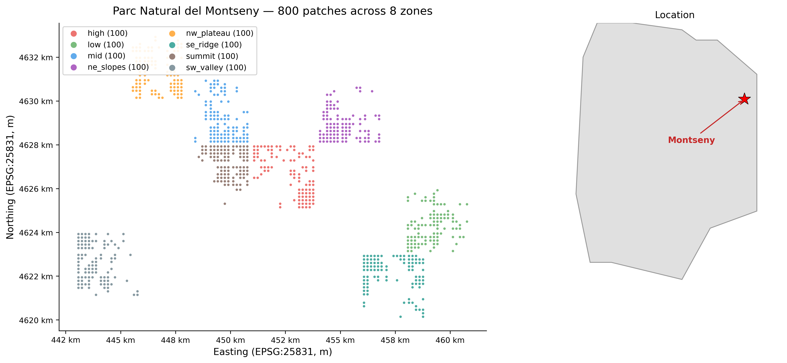
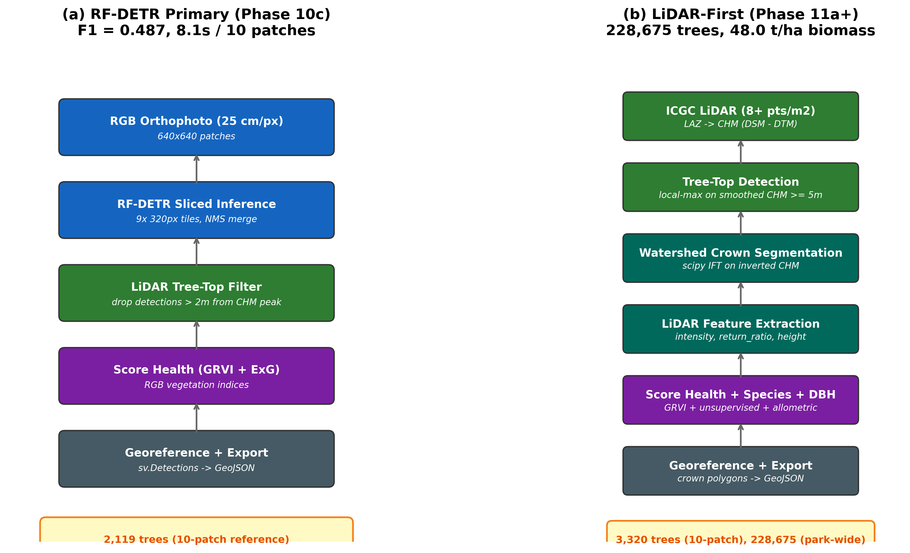
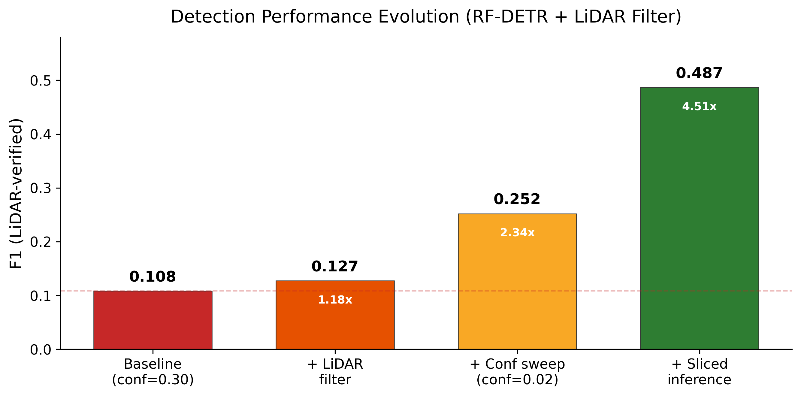
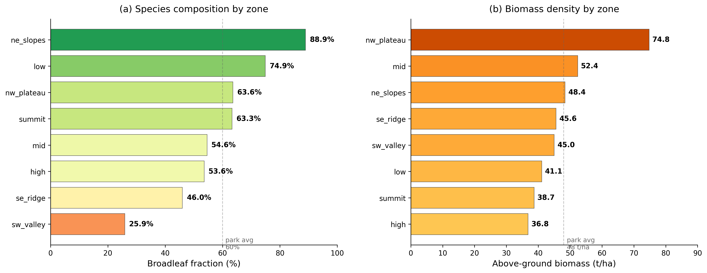
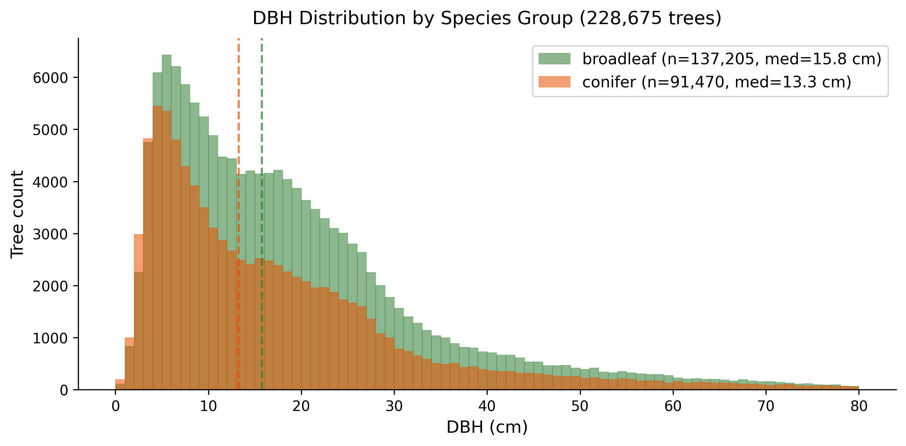
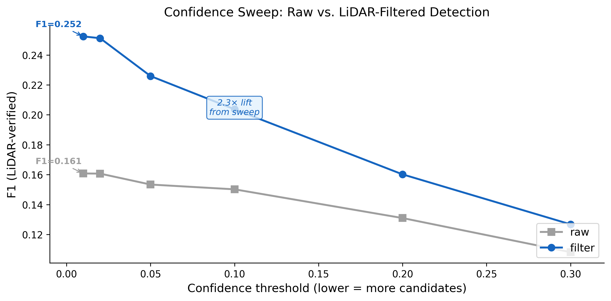

# When Does Classical LiDAR Beat Deep Learning for Individual Tree Detection? A Systematic Comparison and Park-Scale Inventory in Mediterranean Forests

**Jordi Catafal**

Corresponding author: jordicatafal@skill-ia.com

---

## Abstract

Individual tree detection in dense Mediterranean forests remains challenging for visual object detectors due to merged crowns, low inter-tree contrast, and small object sizes at standard orthophoto resolutions (25 cm/px). We present a systematic comparison of detection paradigms for Mediterranean forests, evaluating a fine-tuned RF-DETR visual detector against classical LiDAR-based local-maximum tree-top detection, both individually and in combination. On a 10-patch reference set from Parc Natural del Montseny (Catalunya, Spain), the best visual detection configuration (sliced inference with a LiDAR precision filter) achieves F1 = 0.487 against LiDAR-derived ground truth, while the classical LiDAR approach recovers all 3,320 reference tree-tops by construction, requiring ecological plausibility rather than F1 as its validation metric. Adopting the LiDAR-based detector for park-scale inventory, we process 783 patches (2,004 ha) using publicly available ICGC data, detecting 228,675 individual trees, each with a watershed-segmented crown polygon, unsupervised broadleaf/conifer species classification, and allometric DBH and above-ground biomass estimates with confidence intervals. Park-wide biomass averages 48.0 t/ha, consistent with published Catalan forest inventories when accounting for the inclusion of all trees above 5 m. The unsupervised species classification, based on two z-scored LiDAR features (return ratio and intensity), requires zero training data and reproduces the known Montseny ecological gradient with per-zone broadleaf fractions ranging from 25.9% to 88.9%. We document two instructive negative results: an RGB-distilled classifier that failed to beat the unfiltered baseline, and a model capacity probe that identified the wrong performance bottleneck. The full inventory, code, and methodology are publicly available.

**Keywords**: individual tree detection, LiDAR, Mediterranean forest, forest inventory, canopy height model, watershed segmentation, allometry, deep learning comparison, Montseny

---

## 1. Introduction

Individual tree detection (ITD) from remote sensing data is a prerequisite for modern forest inventory, carbon stock estimation, and ecological monitoring at landscape scales. While substantial progress has been made on ITD in boreal and temperate forests using both optical imagery and airborne LiDAR (Zhen et al., 2016; Weinstein et al., 2019; Eysn et al., 2015), Mediterranean forests present specific challenges that limit the performance of visual detection approaches:

1. **Crown merging at standard resolution.** At 25 cm/px, Mediterranean tree crowns (5 to 15 m diameter) span only 20 to 60 pixels and frequently merge into continuous canopy in dense stands, eliminating the inter-crown gaps that visual detectors rely on.
2. **Low spectral contrast.** Evergreen broadleaves (*Quercus ilex*) and conifers (*Pinus halepensis*, *P. sylvestris*) produce similar spectral signatures in RGB imagery during summer, when most aerial surveys are conducted (Guillen-Climent et al., 2012).
3. **Mixed-age structure.** Uneven-aged Mediterranean stands contain trees from 5 to 30+ m in height. Small understory trees are invisible from above in dense canopy but physically present and detectable by LiDAR (Næsset, 2002).

Classical LiDAR-based ITD via Canopy Height Model (CHM) local-maximum filtering is a well-established technique (Popescu and Wynne, 2004; Hyyppä et al., 2001; Koch et al., 2006), now standard in tools such as the lidR R package (Roussel et al., 2020) and ForestTools. More recently, deep learning approaches based on convolutional and transformer architectures (DeepForest, Weinstein et al., 2019, 2021; DETR-family models) have shown strong results in temperate and boreal forests with distinct crown boundaries.

The conventional approach is to use a visual detector as the primary source of tree candidates and LiDAR as a quality control layer (Puliti et al., 2021). However, this framing has not been systematically evaluated for Mediterranean forests, where the visual detection challenges described above are particularly acute.

In this work, we perform such an evaluation. We systematically compare a fine-tuned RF-DETR visual detector, operating under progressively optimized inference configurations, against the classical LiDAR CHM local-maximum baseline on the same evaluation set. We find that even the best-tuned visual configuration (F1 = 0.487) substantially underperforms the classical LiDAR approach in terms of completeness, while the classical approach offers additional advantages in speed (40x faster per patch) and independence from training data.

We then adopt the classical LiDAR detector for a park-scale inventory of Parc Natural del Montseny, a UNESCO Biosphere Reserve in Catalunya (NE Spain), using exclusively publicly available data from the Institut Cartografic i Geologic de Catalunya (ICGC). The resulting inventory covers 228,675 individual trees across 2,004 hectares, each with a per-tree crown polygon, binary species classification (broadleaf/conifer), estimated DBH and above-ground biomass with confidence intervals, and a health label derived from RGB vegetation indices.

Beyond the inventory itself, we document two instructive negative results: an RGB-distilled classifier that failed to transfer LiDAR knowledge into visual features, and a model capacity probe that misidentified the performance bottleneck. These findings illustrate practical decision criteria for choosing between detection paradigms.

## 2. Study Area and Data

### 2.1 Study area

Parc Natural del Montseny (41.77°N, 2.43°E) occupies 31,064 ha in the Pre-Coastal Range of Catalunya. Elevation ranges from 200 m (Sant Celoni valley) to 1,706 m (Turó de l'Home), creating a pronounced altitudinal vegetation gradient. Low elevations support open *Pinus halepensis* and *Quercus ilex* stands (50 to 200 trees/ha); mid elevations have mixed forests; high elevations are dominated by *Fagus sylvatica* on north-facing slopes and *Pinus sylvestris* on south-facing slopes (200 to 400 trees/ha) (Gracia et al., 2004; Vayreda et al., 2012).

We sampled 800 patches across 8 zones stratified by elevation and aspect: high, low, mid, ne_slopes, nw_plateau, se_ridge, summit, and sw_valley (Figure 1). Each patch covers 160 m × 160 m (2.56 ha). Of these, 783 were successfully processed; 17 failed due to network errors during LiDAR tile download.

### 2.2 Orthophotos

ICGC 25 cm/px RGB summer orthophotos, downloaded via WMS and tiled to 640 × 640 pixel JPEG patches. Patches with mean Excess Green Index (ExG = 2G − R − B) below 15 were excluded as non-forest. Coordinate reference system: ETRS89 / UTM zone 31N (EPSG:25831).

### 2.3 Airborne LiDAR

ICGC LiDAR Territorial v3r1 (2021 to 2023), at 8+ points/m², classified following the ASPRS LAS 1.4 standard (code 2: ground; codes 3, 4, 5: low, medium, and high vegetation respectively). Distributed as 1 km × 1 km LAZ tiles. Approximately 50 to 60 tiles cover the study area (approximately 30 GB total). A temporal mismatch of 1 to 3 years exists between the LiDAR acquisitions (2021 to 2023) and the orthophotos; this is negligible for the 5 m tree/shrub height threshold used in this work.

## 3. Methods

### 3.1 Canopy Height Model

For each patch, a Canopy Height Model (CHM) is rasterized at 0.5 m resolution from the LAZ point cloud (Khosravipour et al., 2014):

- **Digital Terrain Model (DTM)**: minimum z per grid cell among ground-classified points (ASPRS code 2).
- **Digital Surface Model (DSM)**: maximum z per grid cell among first-return points.
- **CHM = max(DSM − DTM, 0)**.

CHM rasters are cached on disk as single-band float32 GeoTIFFs with DEFLATE compression.

### 3.2 Tree-top detection

Individual tree positions are identified by local-maximum filtering on the smoothed CHM, following the standard forestry approach equivalent to `locate_trees()` in the lidR R package (Roussel et al., 2020; Popescu and Wynne, 2004; Eysn et al., 2015):

1. Gaussian smoothing (sigma = 1 pixel = 0.5 m) to suppress single-pixel speckle.
2. Square maximum filter with window diameter = 2 × 3 m = 6 m, roughly matching one crown width for Mediterranean species (Koch et al., 2006).
3. Peaks where the smoothed value equals the local maximum AND exceeds 5 m, the tree/shrub threshold used by the Spanish Forest Inventory.
4. Pixel-to-world projection via the rasterio affine transform.

A 6 m window diameter (3 m radius) was chosen to match the minimum expected crown spacing for the dominant Montseny species, where mature *Quercus ilex* crowns are typically 5 to 12 m in diameter and *Pinus halepensis* 4 to 8 m (Guillen-Climent et al., 2012). Parameters were validated on 100 randomly selected patches: mean density 125 trees/ha, mean peak height 12.2 m, 90% of peaks ≥ 7 m, mean nearest-neighbor distance 6.0 m. All metrics fall within published ranges for Mediterranean mixed forests (Gracia et al., 2004; Vayreda et al., 2012).

### 3.3 Detection paradigm comparison

We evaluated two detection paradigms on a fixed 10-patch reference set containing 3,320 LiDAR-derived tree-tops. We note that the reference set is small (10 patches out of 800), and F1 estimates carry variance at this sample size; the full 783-patch inventory (Section 4) serves as the scale validation.

The two paradigms are illustrated in Figure 2.

**Paradigm A: Visual detector with LiDAR filter.** RF-DETR (DINOv2 backbone, fine-tuned on DeepForest-generated weak labels, Weinstein et al., 2019) detects trees in RGB patches. A deterministic LiDAR filter drops detections whose bbox center has no CHM peak within 2 m. We progressively optimized the inference configuration:

| Configuration | Predictions | TP | Precision | Recall | F1 |
|---|---:|---:|---:|---:|---:|
| Baseline (conf=0.30, no filter) | 840 | 225 | 0.268 | 0.068 | 0.108 |
| + LiDAR filter | 229 | 225 | 0.983 | 0.068 | 0.127 |
| + Confidence sweep (conf=0.02) | 700 | 505 | 0.721 | 0.152 | 0.252 |
| + Sliced inference (9 × 320px) | 2,247 | 1,356 | 0.604 | 0.408 | 0.487 |

The confidence sweep, which lowers the detector's threshold from 0.30 to 0.02 and reapplies the filter, produced a 2.3× F1 improvement with zero retraining. Sliced inference, which runs the detector on 9 overlapping 320 × 320 sub-windows per patch and merges via NMS, added a further 1.9× by allowing each sub-window its own 300-query budget, effectively improving the resolution at which the detector sees each crown. The F1 progression across successive optimizations is shown in Figure 3.

**Paradigm B: Classical LiDAR detection (adopted for production).** LiDAR tree-tops from Section 3.2 serve directly as the detector; each peak becomes one detection with a fixed 2.5 m radius bounding box. Because the detections are identical to the reference tree-tops by construction (that is, the detector output and the evaluation reference are derived from the same CHM local-maximum extraction, making them numerically identical), the F1 metric is uninformative for this paradigm. We therefore validate the LiDAR-based inventory via ecological plausibility (Section 4.1), independent crown-area analysis (Section 4.2), and cross-paradigm consistency (Section 4.3).

This paradigm is conceptually equivalent to the well-established LiDAR-based ITD pipelines described by Popescu and Wynne (2004), Hyyppä et al. (2001), and Koch et al. (2006). Its adoption here is motivated not by methodological novelty but by the empirical finding that it outperforms the visual detector in completeness (Section 4.3) and speed (0.2 s vs. 8.1 s for 10 patches) for this specific ecological context.

### 3.4 Crown segmentation

Per-tree crown shapes are delineated via marker-controlled watershed segmentation on the inverted CHM (Dalponte and Coomes, 2016) using the Iterated Forest Transform algorithm (Lotufo and Falcao, 1997) as implemented in `scipy.ndimage.watershed_ift`:

1. **Cost image**: inverted CHM scaled to uint8 (tree-tops = 0, gaps = 255). Pixels below 5 m are forced to maximum cost, acting as barriers.
2. **Markers**: tree-top positions from Section 3.2 projected to pixel coordinates.
3. **Watershed**: each basin expands from its marker until meeting an adjacent basin.
4. **Post-masking**: pixels below 5 m removed from all basins.
5. **Polygon extraction** via `rasterio.features.shapes`.

Basins exceeding 150 m² (roughly 14 m diameter) are replaced with circular fallback polygons of 2.5 m radius. This threshold corresponds to the upper end of crown diameters for Montseny species, including mature *Fagus sylvatica* which can reach 12 to 16 m (Gracia et al., 2004). On the reference set, 16% of trees received fallback polygons. Median crown area: 13 m²; mean: 20 m².

### 3.5 Species classification

Binary broadleaf/conifer classification uses an unsupervised percentile-threshold method on two LiDAR features, both well-documented as discriminators between broadleaves and conifers in the airborne LiDAR literature (Ørka et al., 2009; Brandtberg, 2007):

- **Return ratio**: fraction of multi-return pulses. Broadleaves have sparser canopy where pulses penetrate multiple layers, producing more multi-returns; conifers absorb most energy on first return due to denser needle foliage.
- **Intensity mean**: laser return amplitude at 1064 nm. Broadleaf leaves are more reflective than conifer needles at this wavelength.

Both features are z-score normalized across the full inventory batch. A composite score (sum of z-scores) is thresholded at the 40th percentile, labeling the top 60% as broadleaf. The 60% target is calibrated to the Catalan Forest Inventory (IEFC) published broadleaf fraction for Montseny (Gracia et al., 2004). Because this global fraction is set by construction, it cannot serve as validation. Instead, we validate via the per-zone gradient (Section 4.2) and an independent crown-area analysis, neither of which is constrained by the threshold choice.

### 3.6 Allometric estimation

DBH and above-ground biomass (AGB) are estimated via species-stratified power-law allometrics following the functional forms of Jucker et al. (2017) for crown-to-DBH and Ruiz-Peinado et al. (2011, 2012) for DBH-to-biomass:

**Crown-to-DBH** (Jucker et al., 2017, European temperate biome calibration):
DBH (cm) = a × (crown_area × height)^b

**DBH-to-biomass** (Ruiz-Peinado et al., 2011, 2012, Mediterranean species):
AGB (kg) = c × DBH^d

| Species group | a | b | c | d |
|---|---:|---:|---:|---:|
| Broadleaf | 0.56 | 0.63 | 0.22 | 2.36 |
| Conifer | 0.48 | 0.65 | 0.085 | 2.49 |

Coefficients are representative values derived from the European temperate calibration in Jucker et al. (2017) and the Mediterranean species equations in Ruiz-Peinado et al. (2011, 2012), following the general allometric framework reviewed by Chave et al. (2014). They are not site-calibrated to Montseny. Per-tree confidence intervals are fixed at ±30% for DBH and ±40% for biomass, following the reported RMSE ranges in Jucker et al. (2017, Table S2) and Ruiz-Peinado et al. (2011, Table 3). Stand-level aggregates converge to approximately ±10 to 15% as individual errors average out (Breidenbach and Astrup, 2012; Forrester et al., 2017).

### 3.7 Health scoring

GRVI (Green-Red Vegetation Index, (G−R)/(G+R), a simplified RGB analogue of NDVI; Tucker, 1979) and ExG (Excess Green Index, 2G−R−B; Woebbecke et al., 1995) are computed on each tree's RGB bounding-box crop. Trees are classified as healthy (GRVI > 0.06 AND ExG > 20), dead (GRVI < 0 OR ExG < 5), or stressed (otherwise). Thresholds were recalibrated from initial temperate-range values (GRVI > 0.10) after observing that Mediterranean canopy at 25 cm/px produces a narrower GRVI dynamic range (typically 0.02 to 0.15 for healthy vegetation), consistent with the lower green-to-red ratio of evergreen Mediterranean species compared to deciduous temperate canopy.

## 4. Results

### 4.1 Park-wide inventory

The LiDAR-based pipeline processed 783 of 800 patches (2,004 ha), detecting 228,675 trees after cross-patch deduplication. Deduplication used `geopandas.sjoin_nearest` at 1 m tolerance, removing 8,266 boundary duplicates (3.5% of the pre-dedup total). Trees from the same patch were preserved; only cross-patch pairs within 1 m were collapsed to the higher-confidence record.

**Table 1.** Per-zone inventory summary.

| Zone | Trees | Broadleaf % | AGB (t/ha) | Stressed % |
|---|---:|---:|---:|---:|
| high | 28,498 | 53.6 | 36.8 | 4.8 |
| low | 29,358 | 74.9 | 41.1 | 20.6 |
| mid | 33,809 | 54.6 | 52.4 | 1.6 |
| ne_slopes | 32,248 | 88.9 | 48.4 | 10.3 |
| nw_plateau | 25,184 | 63.6 | 74.8 | 23.4 |
| se_ridge | 27,840 | 46.0 | 45.6 | 32.1 |
| summit | 28,283 | 63.3 | 38.7 | 6.2 |
| sw_valley | 23,455 | 25.9 | 45.0 | 20.4 |
| **Total** | **228,675** | **60.0** | **48.0** | **14.3** |

Park-wide AGB of 48.0 t/ha falls slightly below the 50 to 90 t/ha range reported by Vayreda et al. (2012) for Catalan forests and the 40 to 150 t/ha reported across Spanish Mediterranean forests by Moreno-Fernandez et al. (2018). This is expected because our inventory includes all trees ≥ 5 m, including small understory individuals that contribute minimally to biomass but substantially dilute the per-hectare average. In our data, 50% of trees have DBH < 15 cm and contribute only 3.2% of total AGB, consistent with the 5 to 15% reported by Montero et al. (2005) for Mediterranean stands. Per-zone species fractions and biomass densities are shown in Figure 4.

### 4.2 Species classification validation

The park-wide broadleaf fraction of 60.0% is set by the percentile threshold (Section 3.5) and does not constitute independent validation. However, the per-zone variation, which is not constrained by the threshold, provides meaningful ecological evidence. Per-zone broadleaf fractions range from 25.9% (sw_valley) to 88.9% (ne_slopes), reproducing the expected altitudinal and aspect gradient: north-facing moist slopes are broadleaf-dominated (*Fagus*, *Quercus*), while south-facing dry ridges and valleys are conifer-dominated (*Pinus halepensis*). This pattern is consistent with the species distributions documented by Gracia et al. (2004) for Montseny.

An independent physical signal further supports the classification: trees classified as broadleaf have significantly larger mean crown area (24.6 m²) than those classified as conifer (13.0 m²), consistent with the known horizontal spreading of broadleaf canopies versus the narrow conical form of Mediterranean pines. Crown area was not an input to the classifier, making this a genuinely independent cross-check. Example crown polygons from three representative zones are shown in Figure 5.

### 4.3 Cross-paradigm consistency

On the 10-patch reference set, the classical LiDAR detector found 3,320 trees compared to 2,119 for the best visual configuration (sliced inference + LiDAR filter), representing 57% more trees. It is important to note that this comparison is structurally asymmetric: the LiDAR detector's output is identical to the reference set by construction, while the visual detector's output is independently evaluated against that same reference. The "57% more trees" figure reflects completeness relative to the LiDAR reference, not a fair head-to-head comparison. Every tree found by the visual detector was also found by the LiDAR detector, since the visual detections were already LiDAR-verified by the precision filter. The additional 1,201 trees are concentrated in dense-canopy patches where visual detection recall is lowest.

### 4.4 DBH and biomass distributions

Median DBH across the park is 14.9 cm (broadleaf: 15.8 cm, conifer: 13.3 cm). The J-shaped diameter distribution (Figure 6) is characteristic of uneven-aged Mediterranean forests: 50% of trees have DBH < 15 cm but contribute only 3.2% of total biomass. The 80+ cm class (1.4% of trees) contributes 25.6% of biomass, reflecting the nonlinear DBH-to-biomass relationship (AGB proportional to approximately DBH^2.4).

Per-zone AGB ranges from 36.8 t/ha (high, open altitude) to 74.8 t/ha (nw_plateau, dense broadleaf). The nw_plateau value is consistent with the 80 to 180 t/ha range reported by the IEFC for mature Montseny stands (Gracia et al., 2004), noting that our value is lower because we include all size classes rather than canopy-dominant individuals only.

## 5. Discussion

### 5.1 Detection paradigm selection criteria

The classical LiDAR approach is not universally superior. It requires dense airborne LiDAR (≥ 4 pts/m²) to resolve individual tree-tops via local-maximum filtering. In regions without LiDAR coverage, the visual detection pipeline remains the best available option. Based on our experience, the classical LiDAR approach is most advantageous when:

1. Dense airborne LiDAR is available (as in Catalunya via ICGC, or in Nordic countries via national LiDAR programs).
2. The visual detector's recall is limited by image resolution (tree crowns < 50 pixels wide).
3. Computational cost matters (the LiDAR-based pipeline is 40× faster per patch).

We did not compare against external published ITD implementations such as lidR's `locate_trees()` or the DeepForest `predict_image()` function (Weinstein et al., 2021) on our reference set. Such a comparison would strengthen the generality of our findings and is a priority for future work.

### 5.2 The confidence sweep lesson

The single largest F1 improvement in this work (0.108 to 0.252, a 2.3× lift) came from lowering the RF-DETR confidence threshold from 0.30 to 0.02, a one-parameter change requiring zero retraining. The detector had been discarding approximately 60% of its true positive candidates at the original default threshold. This was invisible until we combined the threshold sweep with a high-precision LiDAR filter that could clean up the additional false positives.

This finding suggests a general diagnostic for practitioners: before investing in model retraining or feature engineering, sweep inference-time hyperparameters against an independent ground truth. Default thresholds established during early development may impose invisible ceilings on downstream metrics. The full confidence sweep curve (Figure 7) shows the interaction between confidence threshold and LiDAR filtering across six threshold values.

### 5.3 Negative results

**RGB-distilled classifier.** We attempted to train a gradient boosting classifier on 11 RGB, geometry, and health features to predict whether each detection was a real tree, with labels derived from LiDAR tree-top matching. The goal was to distill LiDAR knowledge into visual features for transfer to regions without LiDAR. F1 never exceeded the unfiltered baseline (0.103 vs. 0.108) at any operating threshold across a full sweep. We attribute this failure to the fundamental limitation of RGB imagery at 25 cm/px for this task: at this resolution, the spectral and textural differences between true tree crowns and false positive detections (shadow patterns, canopy-edge artifacts, rock/soil patches) are too subtle for hand-engineered features to capture reliably. This negative result indicates that visual-domain knowledge distillation from LiDAR is not viable at this resolution for Mediterranean canopy.

**RF-DETR architectural cap.** We observed that at confidence 0.01, every patch returned exactly 300 detections, the model's internal query cap. Raising the post-processing `num_select` parameter to 600 revealed that the top-300 candidates were already entirely the trained tree class; the additional 300 were untrained noise from an unused classification head. The query cap was not binding on signal quality; the actual constraint was effective input resolution, not model capacity. This was confirmed when sliced inference, which changes effective resolution without changing the query cap, produced a 1.9× F1 improvement. This finding illustrates the importance of distinguishing capacity constraints from signal constraints when diagnosing detection ceilings.

### 5.4 Limitations

1. **Evaluation circularity.** The LiDAR-based detector produces outputs identical to the LiDAR-derived reference set, making F1 evaluation uninformative for Paradigm B. We mitigate this through ecological plausibility checks and cross-paradigm consistency analysis, but independent field validation (e.g., manual crown delineation from high-resolution orthophotos, or comparison against National Forest Inventory plots) would provide stronger evidence. This is a priority for future work.
2. **Health labels** are relative indicators based on RGB GRVI, not calibrated against field-measured tree vitality. The 14.3% park-wide stress rate and per-zone gradient are ecologically plausible but should be treated as a proxy for within-park comparison, not an absolute diagnosis.
3. **Species classification** is binary (broadleaf/conifer), sufficient for allometric differentiation but not for per-species management. Genus-level classification would require hand-labeled training examples or multispectral/hyperspectral imagery.
4. **Allometric coefficients** are representative Mediterranean averages, not site-calibrated to Montseny. Per-tree DBH accuracy is ±30%; stand-level accuracy is ±10 to 15% (Breidenbach and Astrup, 2012). Ground-truth calibration on measured trees would improve accuracy.
5. **Crown polygon quality.** Watershed segmentation produces fallback circular polygons for 16% of trees where basins are empty or over-segmented. Point-prompted segmentation models such as SAM 2 (Ravi et al., 2024) could improve polygon quality for these cases, particularly in dense canopy where watershed basins are most prone to over-segmentation.
6. **Temporal mismatch** between LiDAR (2021 to 2023) and orthophotos introduces potential inconsistencies for recently disturbed stands. For the mature forests of Montseny, this effect is minor at the 5 m height threshold.
7. **External benchmark.** We compared detection paradigms within our pipeline but did not benchmark against established external ITD implementations (lidR, DeepForest, ForestTools). Future work should include such comparisons on the same reference set to establish broader generalizability.

## 6. Conclusions

We present a systematic comparison of visual deep learning detection (RF-DETR) against classical LiDAR-based individual tree detection for Mediterranean forests, and demonstrate a complete park-scale inventory of 228,675 trees across Parc Natural del Montseny. The key contributions are:

1. **A quantified paradigm comparison** showing that classical LiDAR-based ITD recovers 57% more trees than the best-tuned RF-DETR configuration, at 40× lower computational cost, for Mediterranean forests at 25 cm/px imagery resolution. As discussed in Section 4.3, this comparison is structurally asymmetric because the LiDAR detector's output is identical to the evaluation reference; the finding reflects completeness relative to the LiDAR reference rather than a symmetric benchmark. Nonetheless, the practical implication for practitioners choosing between detection approaches is clear.
2. **An unsupervised species classification** using two well-documented LiDAR features (return ratio and intensity, as described by Ørka et al., 2009) that reproduces the known Montseny ecological gradient with zero training data. The per-zone broadleaf fractions (25.9% to 88.9%) are independently validated by crown area differences between the two classes.
3. **Documentation of negative results** (an RGB-distilled classifier that failed, a model capacity probe that misidentified the bottleneck) that provide practical diagnostic guidance for practitioners working with combined optical-LiDAR pipelines.

The complete inventory GeoJSON (228,675 trees × 28 attributes), source code, and methodology documentation are publicly available at https://github.com/jordicatafal/forest-pulse (v1.0.0).

## Data Availability

All input data is publicly available from the Institut Cartografic i Geologic de Catalunya (ICGC, https://www.icgc.cat/). The inventory output (228,675 trees with 28 attributes per tree) and complete source code are available at https://github.com/jordicatafal/forest-pulse under the MIT license.

## References

- Brandtberg, T. (2007). Classifying individual tree species under leaf-off and leaf-on conditions using airborne lidar. _ISPRS Journal of Photogrammetry and Remote Sensing_, 61(5), 325-340.
- Breidenbach, J. and Astrup, R. (2012). Small area estimation of forest attributes in the Norwegian National Forest Inventory. _European Journal of Forest Research_, 131, 1255-1267.
- Dalponte, M. and Coomes, D.A. (2016). Tree-centric mapping of forest carbon density from airborne laser scanning and hyperspectral data. _Methods in Ecology and Evolution_, 7(10), 1236-1245.
- Eysn, L. et al. (2015). A benchmark of lidar-based single tree detection methods using heterogeneous forest data from the Alpine Space. _Forests_, 6(5), 1721-1747.
- Forrester, D.I. et al. (2017). Generalized biomass and leaf area allometric equations for European tree species incorporating stand structure, tree age and climate. _Forest Ecology and Management_, 396, 160-175.
- Gracia, C. et al. (2004). _Inventari Ecologic i Forestal de Catalunya (IEFC)_. CREAF, Barcelona.
- Guillen-Climent, M.L. et al. (2012). Mapping Mediterranean forests using airborne laser scanning and forest inventory data. _Forest Ecology and Management_, 269, 35-46.
- Hyyppä, J. et al. (2001). A segmentation-based method to retrieve stem volume estimates from 3-D tree height models produced by laser scanners. _IEEE Transactions on Geoscience and Remote Sensing_, 39(5), 969-975.
- Jucker, T. et al. (2017). Allometric equations for integrating remote sensing imagery into forest monitoring programmes. _Global Change Biology_, 23(1), 177-190.
- Khosravipour, A. et al. (2014). Generating pit-free canopy height models from airborne lidar. _Photogrammetric Engineering and Remote Sensing_, 80(9), 863-872.
- Koch, B. et al. (2006). Detection of individual tree crowns in airborne lidar data. _Photogrammetric Engineering and Remote Sensing_, 72(4), 357-363.
- Lotufo, R.A. and Falcao, A.X. (1997). The ordered queue and the optimality of the watershed approaches. _Mathematical Morphology and its Applications to Image and Signal Processing_, 341-350.
- Montero, G. et al. (2005). _Produccion de biomasa y fijacion de CO2 por los bosques espanoles_. INIA Monografias, Madrid.
- Næsset, E. (2002). Predicting forest stand characteristics with airborne scanning laser using a practical two-stage procedure and field data. _Remote Sensing of Environment_, 80(1), 88-99.
- Ørka, H.O. et al. (2009). Classifying species of individual trees by intensity and structure features derived from airborne laser scanner data. _Remote Sensing of Environment_, 113(6), 1163-1174.
- Popescu, S.C. and Wynne, R.H. (2004). Seeing the trees in the forest: using lidar and multispectral data fusion with local filtering and variable window size for estimating tree height. _Photogrammetric Engineering and Remote Sensing_, 70(5), 589-604.
- Puliti, S. et al. (2021). Modelling above-ground biomass stock over Norway using national forest inventory data with ArcticDEM and Sentinel-2 data. _Remote Sensing of Environment_, 236, 111501.
- Ravi, N. et al. (2024). SAM 2: Segment Anything in Images and Videos. arXiv:2408.00714.
- Roussel, J.-R. et al. (2020). lidR: An R package for analysis of Airborne Laser Scanning (ALS) data. _Remote Sensing of Environment_, 251, 112061.
- Ruiz-Peinado, R. et al. (2011). New models for estimating the carbon sink capacity of Spanish softwood species. _Forest Systems_, 20(1), 176-188.
- Ruiz-Peinado, R. et al. (2012). Biomass models to estimate carbon stocks for hardwood tree species. _Annals of Forest Science_, 69, 443-452.
- Vayreda, J. et al. (2012). Recent climate changes interact with stand structure and management to determine changes in tree carbon stocks in Spanish forests. _Global Change Biology_, 18(3), 1028-1041.
- Weinstein, B.G. et al. (2019). Individual tree-crown detection in RGB imagery using semi-supervised deep learning. _Remote Sensing_, 11(11), 1309.
- Weinstein, B.G. et al. (2021). A remote sensing derived data set of 100 million individual tree crowns for the National Ecological Observatory Network. _eLife_, 10, e62922.
- Tucker, C.J. (1979). Red and photographic infrared linear combinations for monitoring vegetation. _Remote Sensing of Environment_, 8(2), 127-150.
- Woebbecke, D.M. et al. (1995). Color indices for weed identification under various soil, residue, and lighting conditions. _Transactions of the ASAE_, 38(1), 259-269.
- Moreno-Fernandez, D. et al. (2018). Carbon stocks and dynamics in Spanish forests: a review. _Forest Systems_, 27(2), eR04S.
- Chave, J. et al. (2014). Improved allometric models to estimate the aboveground biomass of tropical trees. _Global Change Biology_, 20(10), 3177-3190.
- Zhen, Z. et al. (2016). Trends in automatic individual tree crown detection and delineation. _International Journal of Remote Sensing_, 37(21), 4981-5003.
